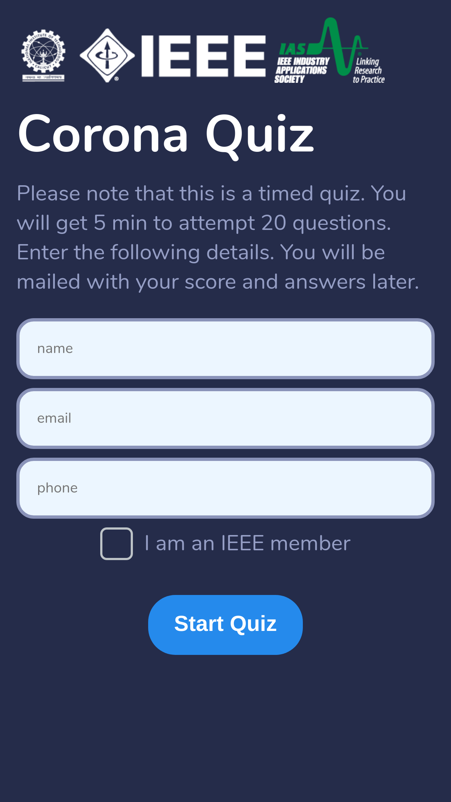
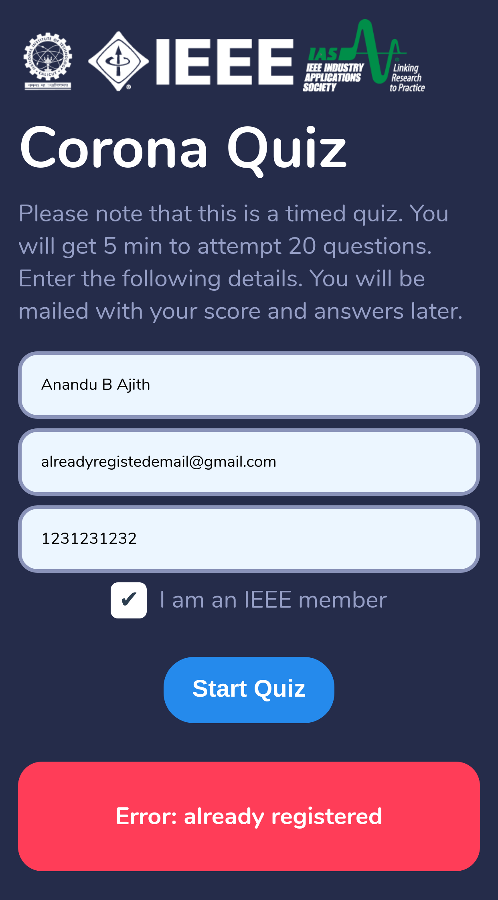
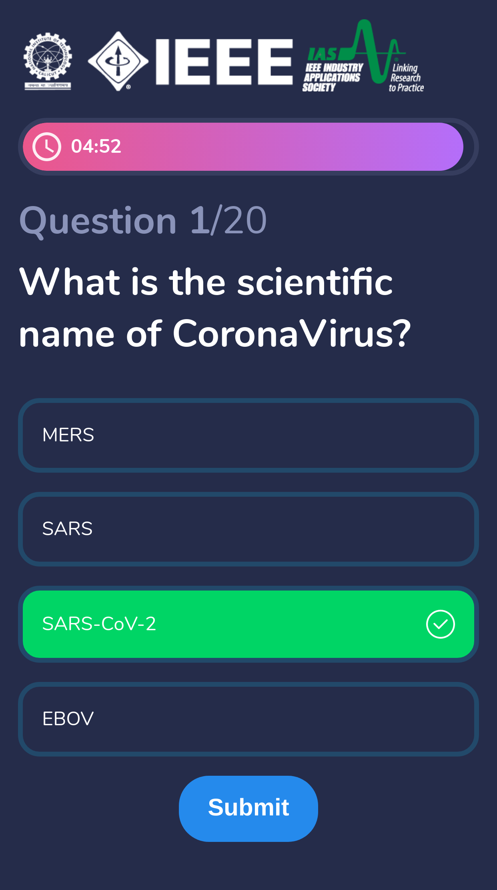
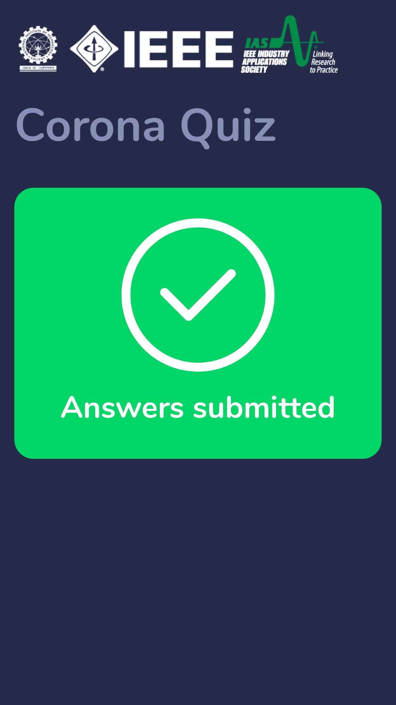

# Vue Quiz app

A simple quiz app built with [VueJS](https://vuejs.org/) , [Express.js](https://expressjs.com/) and PostgreSQL for database.

## Screenshots

| | | | |
|:-----:|:-----:|:-----:|:-----:|
|||||

## Video

